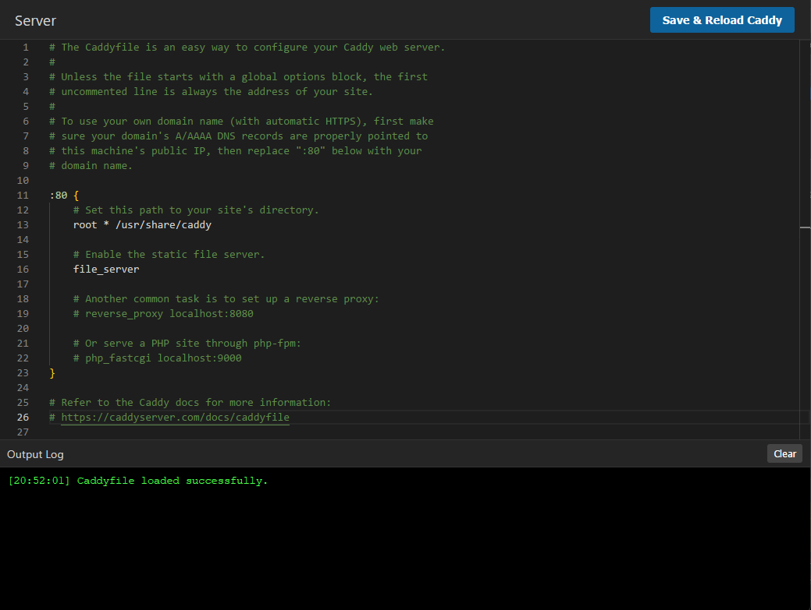

# Caddyfile Editor

A lightweight, locally-hosted web editor for your Caddyfile using the Monaco Editor (powerful editing experience originally from VS Code) that is hosted by the same Caddy instance that you're editing. It validates configuration syntax and catches errors directly via `caddy validate` before reloading your server. 



## Requirements
- Python 3.6+ (For the minimal zero-dependency backend API)
- Caddy 2.x

## Setup Instructions

### 1. Update your Caddyfile
Add a block to your real `Caddyfile` to map a domain/port to the editor and proxy the API. Be sure to change `/path/to/caddy-editor` to the absolute path where you placed this folder (e.g. `/var/www/caddyedit`).

```caddyfile
# You can host it on a specific port, like localhost:9999 or editor.your-domain.com
localhost:9999 {
    # 1. Serve the frontend application
    root * "/var/www/caddyedit"
    file_server

    # 2. Reverse proxy API calls to the local background process
    reverse_proxy /api/* localhost:8080
}
```

Reload Caddy once manually to apply this change:
```bash
caddy reload --config /path/to/your/Caddyfile
```

### 2. Start the Backend API Process
In a terminal, navigate to this `caddy-editor` directory and run the Python backend. Specify the path to your actual Caddyfile.

```bash
python server.py --config "/etc/caddy/Caddyfile" --port 8080 --title "My Server Editor"
```
*Note: Make sure the port used here matches the `reverse_proxy` port specified in your Caddy config. The `--title` flag is optional and changes the frontend header text.*

### 3. Open the Editor
Navigate to `http://localhost:9999` (or the domain you configured) in your browser. You can now visually edit, validate, and safely reload Caddy directly from your browser!

---

## Running as a Background Service

To keep the Python backend running persistently across server reboots, you can set it up as a system service. Ensure the `WorkingDirectory` and `ExecStart` paths match where you installed the editor.

### Debian / Ubuntu (systemd)

1. Create a service file at `/etc/systemd/system/caddy-editor.service`:
```ini
[Unit]
Description=Caddyfile Editor Backend API
After=network.target caddy.service

[Service]
Type=simple
# Run as the caddy user for security
User=caddy
Group=caddy
WorkingDirectory=/var/www/caddyedit
ExecStart=/usr/bin/python3 /var/www/caddyedit/server.py --config /etc/caddy/Caddyfile --port 8080 --title "Main Web Server"
Restart=on-failure
RestartSec=5

[Install]
WantedBy=multi-user.target
```

2. Enable and start the service:
```bash
sudo systemctl daemon-reload
sudo systemctl enable --now caddy-editor
```

### Alpine Linux (OpenRC)

1. Create a service script at `/etc/init.d/caddy-editor`:
```sh
#!/sbin/openrc-run

name="caddy-editor"
description="Caddyfile Editor Backend API"
command="/usr/bin/python3"
command_args="/var/www/caddyedit/server.py --config /etc/caddy/Caddyfile --port 8080 --title 'Main Server Editor'"
command_background="yes"
command_user="caddy:caddy"
pidfile="/run/${name}.pid"

depend() {
    need net
    after caddy
}
```

2. Make it executable and start it:
```bash
sudo chmod +x /etc/init.d/caddy-editor
sudo rc-update add caddy-editor default
sudo service caddy-editor start
```
